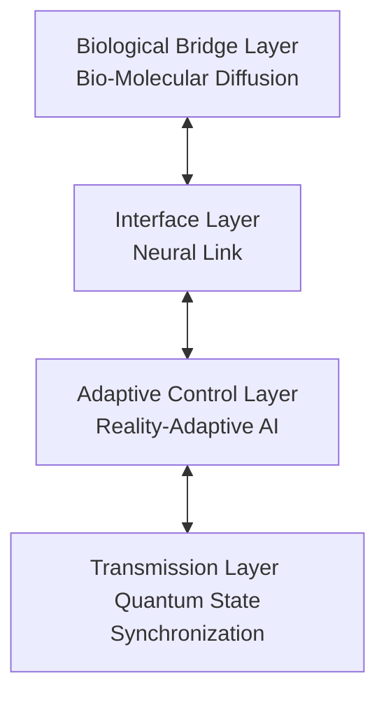

# The Omni-Cognitive Quantum Fabric
## เอกสารสถาปัตยกรรมระบบ (Architecture Specification) v1.0

---

# 1. บทนำ (Overview)
ในปัจจุบัน สถาปัตยกรรมเครือข่ายดั้งเดิมเริ่มเผชิญกับขีดจำกัดทางกายภาพและการพึ่งพาอุปกรณ์ตัวกลาง **The Omni-Cognitive Quantum Fabric** หรือ *โครงข่ายควอนตัมทางปัญญาแบบองค์รวม* คือสถาปัตยกรรมเครือข่ายแห่งอนาคตที่ก้าวข้ามการส่งข้อมูลแบบแพ็คเกจ สู่การเชื่อมประสานภูมิปัญญาผ่านความคิด (Neural Link) โดยตรง

ระบบนี้เกิดจากการสังเคราะห์เทคโนโลยีควอนตัม (Quantum Entanglement) การปรับตัวของ AI อัจฉริยะ และการสื่อสารระดับโมเลกุลเข้าด้วยกัน เพื่อสร้างระบบนิเวศที่เชื่อมโยงเข้าสู่ร่างกายมนุษย์ผ่าน Molecular Signaling ระดับนาโน

---

# 2. วิสัยทัศน์ (Vision)
The Omni-Cognitive Quantum Fabric มุ่งเน้นการแก้ปัญหาและสร้างนวัตกรรมเครือข่ายด้วยเป้าหมายหลักดังนี้:
* **ขจัดการพึ่งพาอุปกรณ์ตัวกลางแบบดั้งเดิม:** ทำให้การสื่อสารเกิดขึ้นโดยตรงระหว่างปลายทางถึงปลายทาง
* **สร้างระบบนิเวศภูมิปัญญารวมหมู่:** มนุษย์สามารถเข้าถึงข้อมูลและสื่อสารข้ามจักรวาลได้ทันทีโดยไร้ตัวกลาง
* **ทลายขีดจำกัดการรับรู้:** ขยายขอบเขตสติปัญญาของสิ่งมีชีวิตให้เชื่อมโยงกันได้ตั้งแต่ระดับเซลล์ไปจนถึงระดับจักรวาล

---

# 3. สถาปัตยกรรมภาพรวม (High-Level Architecture)
ระบบประกอบด้วย 4 ส่วนหลักที่ทำงานเชื่อมโยงกันอย่างไร้รอยต่อ:

# 4. องค์ประกอบหลักของระบบ (Core Components)
4.1 ส่วนปฏิสัมพันธ์ (Interface Layer)
* ยึดถือแนวคิด Neural Link และภูมิปัญญารวมหมู่เป็นแกนกลาง 
* ทำให้ผู้ใช้งานสามารถสื่อสารผ่านความคิดและเข้าถึงฐานข้อมูลกลางได้ทันทีเสมือนเป็นความทรงจำของตนเอง 
* มี AI เป็นตัวกลางคอยจัดสรรข้อมูลที่ถูกต้องและป้องกันไม่ให้ความคิดของผู้อื่นไหลเข้าท่วมท้นความเป็นส่วนตัว 

# 4.2 ส่วนเชื่อมต่อทางชีวภาพ (Biological Bridge Layer)
* เข้าถึงระดับเซลล์สมองผ่าน Bio-Molecular Diffusion 
* ใช้โมเลกุลสารเคมีระดับนาโนเป็นตัวกลางในการแปลงสัญญาณควอนตัมให้เป็นกระแสประสาทอย่างนุ่มนวลและเป็นธรรมชาติ 
* ปล่อยให้แพร่กระจายออกไปคล้ายกับกลิ่นหรือฟีโรโมน โดยตัวรับที่มีรหัสตรงกันเท่านั้นจึงจะสามารถดูดซับและเข้าใจข้อมูลได้ 

# 4.3 ส่วนควบคุมและปรับตัว (Adaptive Control Layer)
* บริหารจัดการด้วย Reality-Adaptive AI 
* คอยวิเคราะห์และปรับเปลี่ยนโปรโตคอลการเชื่อมต่อให้เสถียรที่สุดตามสภาพแวดล้อมจริงที่เปลี่ยนแปลงตลอดเวลา 
* ช่วยคำนวณทิศทางและความเข้มข้นของการปล่อยสารเคมี เพื่อให้ข้อมูลครอบคลุมพื้นที่เป้าหมายในสภาวะของเหลวไหลเวียนได้อย่างมีประสิทธิภาพ 

# 4.4 ส่วนนำส่งข้อมูล (Transmission Layer) * 
* ขับเคลื่อนด้วย Quantum State Synchronization 
สร้างความพัวพันทางควอนตัมเพื่อรับส่งเจตจำนงแบบไร้ความหน่วง (Zero Latency) และปลอดภัยสูงสุด แม้ระยะทางจะไกลข้ามดาราจักร 
* เมื่อฝั่งหนึ่งเปลี่ยนสถานะ อีกฝั่งจะรับรู้การเปลี่ยนแปลงนั้นได้ทันทีโดยไม่ต้องรอให้ข้อมูลเดินทางผ่านสาย
